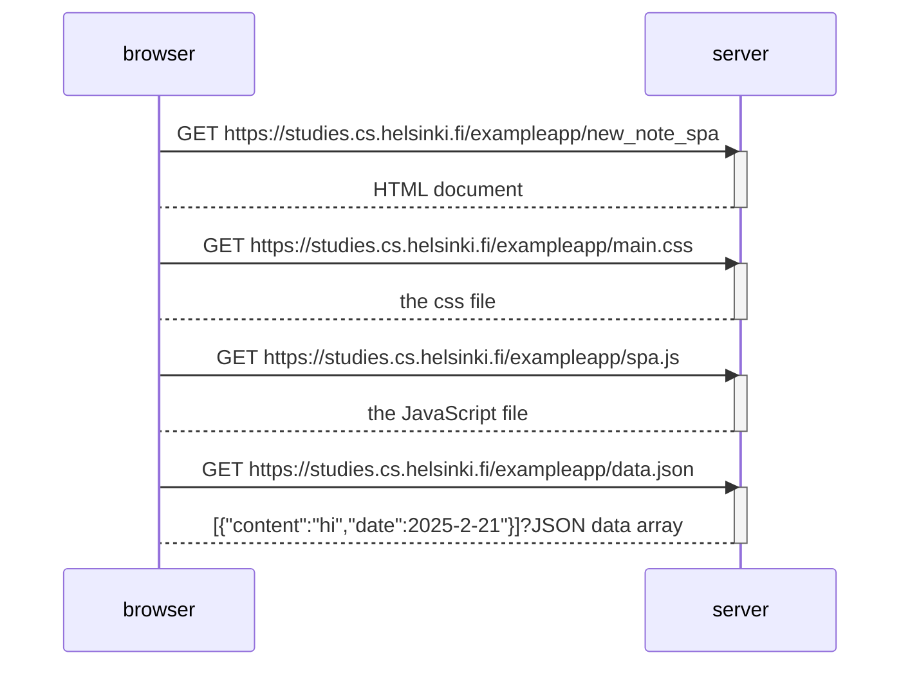

```mermaid
sequenceDiagram
participant browser
participant server
browser ->> server: GET https://studies.cs.helsinki.fi/exampleapp/new_note_spa
activate server
server --> browser: HTML document
deactivate server

browser ->> server: GET https://studies.cs.helsinki.fi/exampleapp/main.css
activate server
server --> browser: the css file
deactivate server

browser ->> server: GET https://studies.cs.helsinki.fi/exampleapp/spa.js
activate server
server --> browser: the JavaScript file
deactivate server

browser ->> server: GET https://studies.cs.helsinki.fi/exampleapp/data.json
activate server
server --> browser: [{"content":"hi","date":2025-2-21"}]?JSON data array
deactivate server


```