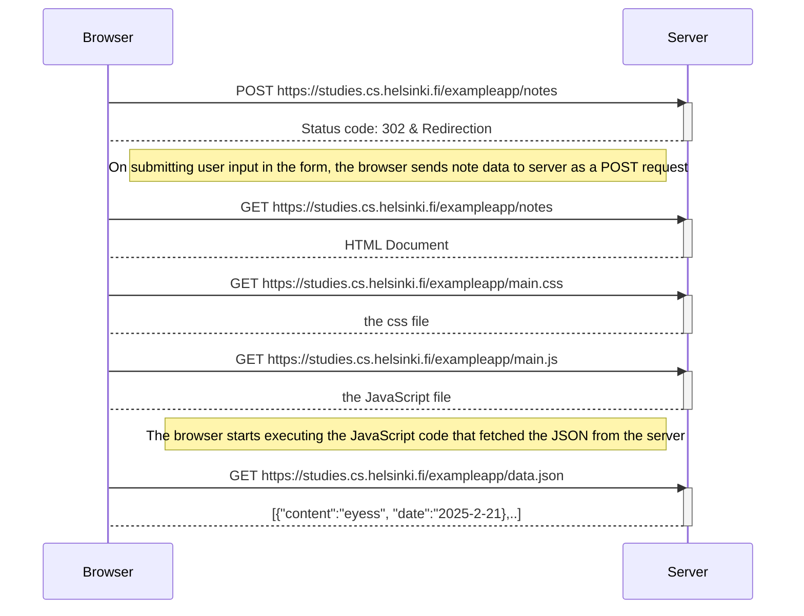

```mermaid
    sequenceDiagram 
    participant Browser
    participant Server
    Browser ->> Server : POST https://studies.cs.helsinki.fi/exampleapp/notes 
    activate Server
    Server --> Browser: Status code: 302 & Redirection
    deactivate Server
    Note left of Server: On submitting user input in the form, the browser sends note data to server as a POST request

    Browser ->> Server: GET https://studies.cs.helsinki.fi/exampleapp/notes 
    activate Server
    Server --> Browser: HTML Document
    deactivate Server

    Browser ->> Server: GET https://studies.cs.helsinki.fi/exampleapp/main.css
    activate Server
    Server --> Browser: the css file
    deactivate Server

    Browser ->> Server: GET https://studies.cs.helsinki.fi/exampleapp/main.js
    activate Server
    Server --> Browser: the JavaScript file
    deactivate Server
    Note left of Server: The browser starts executing the JavaScript code that fetched the JSON from the server

    Browser ->> Server: GET https://studies.cs.helsinki.fi/exampleapp/data.json
    activate Server
    Server --> Browser: [{"content":"eyess", "date":"2025-2-21},..]
    deactivate Server


    


```
