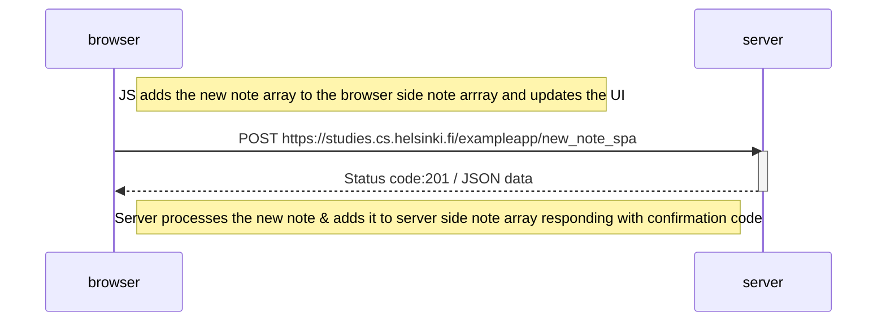

```mermaid
sequenceDiagram
participant browser
participant server

Note right of browser: JS adds the new note array to the browser side note arrray and updates the UI
browser ->> server: POST https://studies.cs.helsinki.fi/exampleapp/new_note_spa
activate server
server -->> browser: Status code:201 / JSON data
deactivate server
Note right of browser : Server processes the new note & adds it to server side note array responding with confirmation code


```
